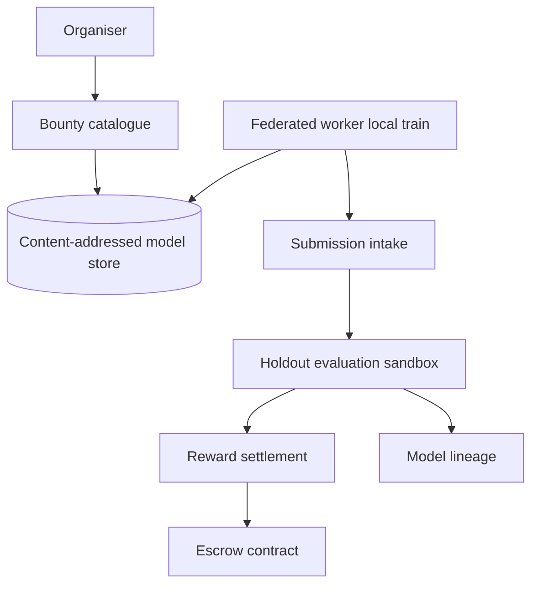

# Fedbounty

**Source:** `ai-in-decentralized+ai/aiblockchain-180511025341/`
**Domain:** `ai-decentralized`
**One-liner:** A federated model-improvement bounty exchange where organisers publish base models and holdout validation criteria, workers train locally on private data, and rewards pay out only on measured validation lift — with anti-poisoning enforced by scoring improvements workers cannot see.
**Wedge:** ML organisers (enterprises, research labs, OpenMined-style communities) who rejected on-chain training after DanKu-style cost pain (15MB storage ~270 ETH) and want federated local training with Sonar-like smart-contract rewards tied to validation-set improvement, not self-reported gradients.
**Positioning:** Federated bounty settlement. Ivan Kukanov's May 2018 talk fuses AI and blockchain: DanKu protocol markets ML scientists/miners/organisers with Ether rewards but on-chain ML is impractical (storage cost, Solidity math pain); OpenMined combines federated learning, IPFS models, MPC vs homomorphic encryption, and Sonar contracts where users train locally, upload to IPFS, and earn rewards — with hijack resistance because reward is measured on a validation set (% improvement maps to reward). Fedbounty productises that exchange — distinct from Agentfence (agent autonomy control) and Modelescrow (model escrow).

## Market research synthesis

### Thesis from source

The presentation "AI and Blockchain Fusion" contrasts blockchain's self-developing systems (consensus, mining incentives, tokens) with AI's revolution (GPU farms, deep neural networks, data growth). Ethereum enables tokens, DApps, smart contracts, DAOs, and decentralised marketplaces — but putting AI directly on-chain is "impossible" in practice. DanKu protocol illustrates the attempt: a market of ML scientists, miners, and organisers with Ether incentives for training — yet implementation hits brutal constraints: hashing and storing 15MB of data costs roughly 270 ETH; training/test selection, model evaluation, and math in Solidity are painful; model and data anonymisation and execution timeouts add friction.

OpenMined is offered as the workable fusion: encrypted decentralised AI with IPFS for content-addressed model storage (reducing gas versus on-chain blobs), federated learning so data never leaves the device, encryption via multi-party computation (suited to large DNNs) versus homomorphic encryption (smaller models), and Sonar smart contracts for a transparent marketplace where corporations cannot hiddenly steal data. Typical flow: organiser posts a model to contract/IPFS; user downloads and trains locally; sends updated model back via IPFS; user receives reward; organiser aggregates improvements.

The critical anti-abuse insight: fake data cannot hijack the main model because reward is measured on a validation set the worker does not control — percentage improvement on that holdout corresponds to payout. PySonar demo (diabetes prediction) grounds the pattern in code. Ethical framing: users could earn from sharing; data stays encrypted; training happens without central exfiltration (contrast with unread Terms & Conditions and myactivity.google.com surveillance). Summary incentive: reward for improving AI models, not for merely uploading parameters.

### Buyer & economic model

- **Primary buyer:** Head of ML platform or chief data scientist sponsoring a federated improvement programme with compliance constraints against centralising raw training data.
- **Users:** bounty organiser defining base model and validation criteria, federated workers (data holders), ML engineer reviewing aggregated models, smart-contract operator managing reward pools, compliance officer auditing that holdout sets stayed organiser-controlled.
- **Budget owner / value metric:** ML R&D and data acquisition budget; value metric is validation lift per dollar versus centralized training or DanKu-style on-chain attempts, plus reduction in poisoned-model incidents.
- **Competing status quo:** centralized GPU training on copied data, Kaggle competitions with uploaded notebooks, manual federated rounds without automated holdout scoring, or pure OpenMined DIY without commercial SLA.

### Domain constraints

- **Regulatory / trust / safety:** workers' local data may be personal or regulated; holdout validation must not leak worker data back through gradients; reward fairness when workers contribute unequal data volume; smart-contract and IPFS availability.
- **Data sensitivity:** training data never leaves worker boundary; validation set stays organiser-controlled; model weights transit via IPFS content addresses.
- **Change-management realities:** organisers will not rewrite PySonar; Fedbounty must accept standard model formats and publish clear validation metrics workers cannot game without holdout access.

## Business requirements

- BR-1: Organisers must publish a base model, validation criteria, and reward curve mapping validation-set improvement percentage to payout before workers enroll.
- BR-2: Workers must train only locally; raw training data must not transit through Fedbounty or on-chain storage.
- BR-3: Submitted model artifacts must be scored exclusively on organiser-held validation data; workers must not receive holdout labels or subsets.
- BR-4: Rewards must pay automatically when improvement exceeds a documented threshold; zero or negative lift must pay zero.
- BR-5: Anti-poisoning rules must reject submissions that improve worker-visible metrics while degrading holdout performance.
- BR-6: Model storage must use content-addressed off-chain references (IPFS-style) rather than on-chain weight blobs, avoiding DanKu-scale gas costs.
- BR-7: Organisers must aggregate accepted improvements into a new canonical model version with provenance of contributing workers.
- BR-8: Federated rounds must support MPC/HE policy flags per bounty so organisers declare expected privacy mechanism without mandating one stack.
- BR-9: Disputes on scoring must replay evaluation on frozen validation snapshots with audit logs.
- BR-10: Bounty budgets must escrow with transparent remaining pool and per-worker caps to prevent drain attacks.
- BR-11: Workers must attest software environment compatibility before download to reduce garbage submissions.
- BR-12: Exportable reports must tie each payout to validation delta and model hash for finance and research audit.

## User stories

Canonical user stories live in sibling [USER_STORIES.md](USER_STORIES.md).

## System design

### Overview

Fedbounty orchestrates federated improvement bounties. Organisers upload base models and register validation snapshots; workers enroll, pull models via content-addressed storage, train locally, and submit updated weights; an evaluation service scores holdout lift in an organiser-controlled sandbox; smart-contract or off-chain settlement pays rewards on measured improvement; accepted weights merge into the next model generation with full provenance.

### Actors & boundaries

- **Actors:** organiser, federated worker, ML engineer, evaluation service (organiser-controlled), smart-contract escrow, compliance, finance, platform admin.
- **Trust boundary:** worker data never crosses into organiser training pipelines except as aggregated model deltas; holdout validation runs only in organiser sandbox; Fedbounty sees hashes, scores, and payout metadata.
- **Human-in-the-loop points:** bounty design approval; dispute replay; bounty freeze on leakage suspicion; manual merge conflict resolution for competing improvements.

### Core capabilities

1. **Bounty catalogue** — base model, criteria, reward curve, privacy flags.
2. **Worker enrollment and attestation** — environment checks, terms acceptance.
3. **Artifact intake** — IPFS/content-addressed model submissions.
4. **Holdout evaluation** — sandboxed scoring, anti-poison checks.
5. **Reward settlement** — improvement-percentage to payout mapping.
6. **Model lineage** — version graph of merges and contributors.
7. **Audit export** — scores, hashes, payments.

### Conceptual data

- **Primary entities:** Bounty, BaseModel, ValidationSnapshot, RewardCurve, WorkerEnrollment, ModelSubmission, EvaluationResult, RewardPayout, ModelVersion, EscrowAccount, Dispute.
- **Critical events:** bounty published, worker enrolled, model submitted, evaluation completed, reward paid, model merged, bounty frozen.
- **Retention / audit needs:** evaluation logs and payout records for research/finance windows; no worker raw data retention in Fedbounty.

### Integrations (conceptual)

- **Systems of record:** IPFS or compatible object store, smart-contract escrow (Sonar-style), local training runtimes on worker devices, organiser ML sandbox.
- **Upstream signals:** submission uploads, evaluation metrics, escrow balance.
- **Downstream actions:** payout execution, model merge notifications, Agentfence hooks if workers are automated agents (optional future).

### High-level architecture

### Success metrics

- **Leading:** worker enrollment per bounty; median evaluation turnaround; submission rejection rate for format/poison; escrow utilisation.
- **Lagging:** average validation lift per bounty dollar; organiser repeat rate; poison incidents caught pre-merge; cost per lift point versus centralized baseline and versus DanKu-scale on-chain storage costs.

## OpenAPI skeleton

Canonical HTTP surface lives in sibling [openapi.yaml](openapi.yaml). Summary:

- **Base path:** `/v1/...`
- **Auth:** `X-API-Key` for worker submission agents; Bearer JWT for organisers and admins.
- **Resource groups:** Bounties, Submissions, Validations, Rewards, Lineage, Reporting.
