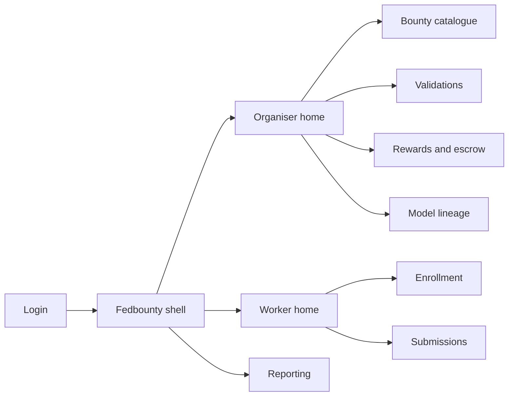
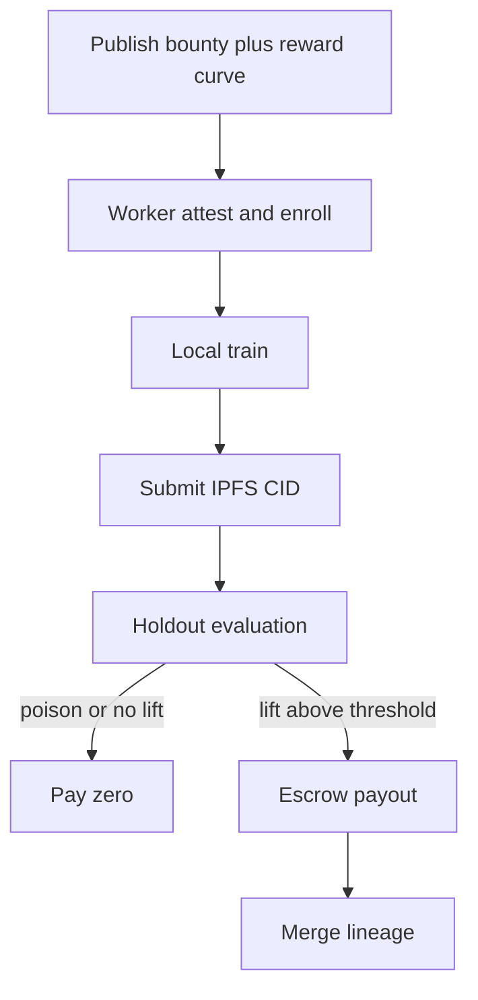

# Fedbounty — Web app

**Product:** [PRODUCT.md](./PRODUCT.md)
**Primary surface:** Dual-sided federated bounty exchange (organiser desk + worker console)
**Secondary surfaces:** Escrow statement viewer; dispute replay sandbox (read-only metrics UI)
**Design thesis:** Fedbounty is a holdout-settled improvement exchange — the UI metaphor is a validation weigh-station and escrow counter, not a Kaggle leaderboard you can game or a DanKu on-chain weight dump. Visual language is deep ocean ink with buoy-orange for pending evaluations and ledger-teal for paid lift; IPFS content ids feel like shipping manifests. The brand wordmark sits as a quiet mint seal on every payout screen so finance knows whose Sonar-style settlement they are trusting.

## UX research synthesis

### Category peers (best-in-class)

- **Kaggle / DrivenData competition hosts:** Clear problem statements, metrics, and submission formats. Steal: publish criteria before enroll (BR-1); reject public leaderboards that expose holdout-gameable feedback loops — Fedbounty keeps holdout organiser-only (BR-3).
- **Numerai:** Staked model improvement with opaque tournament scoring. Steal: reward tied to measured lift not self-report; reject requiring centralised feature exposure of worker private data.
- **OpenMined / PySonar patterns:** Local train → IPFS model → Sonar reward on validation improvement. Steal: content-addressed artifacts and local-only training chrome (BR-2, BR-6); reject DIY notebook as the only operator surface.
- **Gitcoin / escrow bounties:** Transparent remaining pool and caps. Steal: escrow remaining + per-worker caps against drain (BR-10); reject paying for mere parameter upload without lift.

### Patterns to adopt / reject

- **Adopt:** Reward curve on validation % improvement; zero pay for non-positive lift; anti-poison when public metrics rise but holdout falls; IPFS CIDs not on-chain blobs; MPC/HE policy flags; dispute replay on frozen snapshots; environment attestation before download.
- **Reject:** 15MB-on-chain storage UX; Solidity math as user journey; worker access to holdout labels; Agentfence kill-switch chrome as home (different product); purple “decentralised AGI marketplace” browse.

### Trust, density, and workflow constraints from PRODUCT.md

Publish base model, criteria, reward curve first (BR-1). Local train only (BR-2). Score on organiser holdout only (BR-3). Auto-pay on threshold lift (BR-4). Anti-poison rules (BR-5). Off-chain content addresses (BR-6). Aggregate with provenance (BR-7). Privacy mechanism flags (BR-8). Dispute replay (BR-9). Escrow transparency (BR-10). Environment attestation (BR-11). Payout↔delta↔hash reports (BR-12).

## Information architecture

### Nav model

### Roles → default home

| Role | Default home | Why |
|------|--------------|-----|
| ML bounty organiser | Organiser home | Publish and aggregate lifts |
| Federated worker | Worker home | Local train and submit |
| ML platform engineer | Submissions / Validations | CID intake and sandbox health |
| Compliance officer | Reporting / freeze controls | Holdout custody evidence |
| Finance controller | Rewards and escrow | Budget vs verified lift |
| Platform administrator | Bounty freeze queue | Leakage / crash quarantine |

### Cross-links to OpenAPI resources

| Nav area | OpenAPI tags / resources |
|----------|---------------------------|
| Bounty catalogue | Bounties |
| Submissions | Submissions |
| Validations | Validations |
| Rewards and escrow | Rewards |
| Model lineage | Lineage |
| Reporting | Reporting |

## Screen inventory

### Organiser home

- **Purpose:** Answer “which bounties bought real holdout lift per escrow dollar?” in one composition.
- **Entry:** Organiser login.
- **Layout regions:** Brand + workspace; active bounties; lift per dollar; poison rejects; escrow remaining; freeze alerts.
- **Primary actions:** Create bounty; open evaluation queue; export finance pack.
- **Empty / loading / error:** Empty = publish first base model + criteria; error = retry with request id.
- **BR / story ties:** BR-1, BR-12; organiser stories.

### Bounty catalogue and editor

- **Purpose:** Publish base model, validation criteria, reward curve, MPC/HE flags.
- **Entry:** Nav → Bounties; home CTA.
- **Layout regions:** Catalogue; editor: base model CID, holdout snapshot id (organiser-only), reward tiers, privacy flags, worker caps.
- **Primary actions:** Publish; pause; freeze; clone.
- **Empty / loading / error:** Cannot publish without reward curve and holdout binding (BR-1).
- **BR / story ties:** BR-1, BR-8, BR-10.

### Worker home and enrollment

- **Purpose:** Discover bounties; attest environment; accept terms; download base model.
- **Entry:** Worker login.
- **Layout regions:** Open bounties; attestation checklist; terms (anti-poison); download CID; provisional public-metric sandbox tip (not holdout).
- **Primary actions:** Enroll; attest; download; open submit.
- **Empty / loading / error:** Failed attestation blocks download (BR-11).
- **BR / story ties:** BR-2, BR-11; worker stories.
- **Mobile notes:** Enrollment OK on tablet; training stays on worker machine/CLI.

### Submission intake

- **Purpose:** Accept content-addressed model updates; reject format/timeout garbage.
- **Entry:** Worker submit; engineer queue.
- **Layout regions:** Submission table (CID, status); format/timeout rejects; quarantine for sandbox crashes.
- **Primary actions:** Submit; retry; open evaluation.
- **Empty / loading / error:** On-chain blob attempt rejected with DanKu-cost rationale (BR-6).
- **BR / story ties:** BR-5, BR-6; platform engineer stories.

### Holdout validation desk

- **Purpose:** Score exclusively on organiser-held validation; surface anti-poison.
- **Entry:** New submission; organiser eval nav.
- **Layout regions:** Evaluation queue; holdout delta; public-metric vs holdout compare; poison reject banner; frozen snapshot id.
- **Primary actions:** Run eval; reject poison; open dispute replay.
- **Empty / loading / error:** Worker never sees holdout labels (BR-3).
- **BR / story ties:** BR-3, BR-5, BR-9.

### Rewards and escrow

- **Purpose:** Map improvement % to payout; show remaining pool and caps.
- **Entry:** Positive eval; finance home.
- **Layout regions:** Escrow balance; per-worker caps; payout log (zero for non-positive); settlement status.
- **Primary actions:** Confirm auto-pay; pause escrow; export statements.
- **Empty / loading / error:** Drain attempt blocked by caps (BR-10).
- **BR / story ties:** BR-4, BR-10; finance stories.

### Model lineage

- **Purpose:** Aggregate accepted improvements into canonical versions with contributor provenance.
- **Entry:** After payouts; nav → Lineage.
- **Layout regions:** Version graph; contributor list; merge conflicts needing human resolve.
- **Primary actions:** Merge; pin canonical; notify workers.
- **Empty / loading / error:** Conflict queue highlighted.
- **BR / story ties:** BR-7.

### Dispute replay and reporting

- **Purpose:** Replay eval on frozen snapshots; export payout↔delta↔hash.
- **Entry:** Dispute; compliance/finance export.
- **Layout regions:** Replay viewer; audit log; period report builder.
- **Primary actions:** Replay; export; freeze bounty on leakage suspicion.
- **Empty / loading / error:** Missing snapshot = cannot settle dispute.
- **BR / story ties:** BR-9, BR-12.

## Key flows

1. **Publish to payout** — define bounty → workers enroll/attest → local train → CID submit → holdout eval → pay on lift → merge lineage; failure: poison or non-positive lift pays zero (BR-1–BR-7).

2. **Anti-poison reject** — public metrics up, holdout down → reject → no merge (BR-5).

3. **Dispute** — challenge score → replay frozen snapshot → settle (BR-9).

4. **Freeze on leakage suspicion** — admin freeze → halt evals/payouts → investigate (compliance).

5. **Finance audit** — period export tying each payout to delta and model hash (BR-12).

## Design system

### Tokens (CSS variables)

- `--color-ink: #E6EEF5` — text
- `--color-ocean-950: #061018` — ground
- `--color-ocean-900: #0E1A24` — panels
- `--color-buoy: #E0893A` — pending evaluation
- `--color-ledger: #2DB89A` — paid lift / settled
- `--color-coral: #E25B4C` — poison / freeze
- `--color-steel: #7E93A6` — secondary
- `--color-brand: #8FB8C9` — Fedbounty wordmark
- `--font-display: "Space Grotesk", sans-serif`
- `--font-mono: "IBM Plex Mono", monospace` — CIDs, hashes, deltas
- `--space-1`…`--space-8`: 4px scale
- `--radius-sm: 4px`; `--radius-md: 8px`
- `--motion-eval: 200ms ease-out` — score reveal
- `--motion-pay: 220ms ease-out` — payout flash
- `--motion-freeze: 260ms ease-in-out` — freeze veil
- Atmosphere: subtle shipping-lane lines; content-address manifest aesthetic — no coin-flipping crypto kitsch.

### Typography & brand

- Space Grotesk for titles and lift %; mono for CIDs and escrow ids.
- Brand on payout and organiser home.
- Login: brand hero; headline (“Pay for holdout lift, not uploads”); one CTA.

### Do / don’t

- **Do:** Hide holdout from workers; show escrow remaining; CID-first storage; zero-pay for no lift.
- **Don’t:** On-chain weight upload wizards; public holdout leaderboards; purple AGI marketplace mall; Agentfence as primary nav.

### Accessibility & domain trust cues

- AA+ contrast; poison rejects announced with text.
- Live regions for payout and freeze.
- Focus order: bounty → enroll → submit → eval → reward → lineage.

## Component patterns

- **RewardCurveEditor** — improvement % → payout tiers.
- **HoldoutScorePanel** — organiser-only delta with snapshot id.
- **PoisonRejectBanner** — public vs holdout divergence.
- **IpfsCidManifest** — content-addressed artifact row.
- **EscrowPoolMeter** — remaining + caps.
- **WorkerAttestationChecklist** — environment gate.
- **LineageMergeGraph** — contributors → canonical version.
- **PayoutAuditRow** — delta + hash + amount.

## Out of scope for v1 web

- Full on-chain training (DanKu-class); Agentfence autonomy control plane; consumer social app; training IDE hosted in Fedbounty; AGI token marketplace browse.
